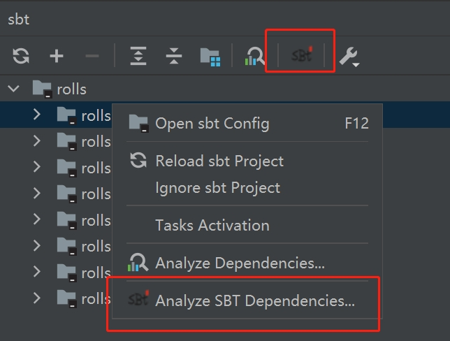

Sbt Dependency Analyzer for IntelliJ IDEA
---------


[](https://github.com/bitlap/intellij-sbt-dependency-analyzer/actions/workflows/ScalaCI.yml)
[](https://plugins.jetbrains.com/plugin/22427-sbt-dependency-analyzer)

## Features

> Support since Intellij IDEA 2023.1 (231.9392.1)

- View Dependency Tree
- Show Conflicts
- Search Dependencies
- Locate Dependency (multi-module)
- Show dependencies between modules

## Usage Instructions

To use this Intellij IDEA plugin, please put this line into `project/plugins.sbt` of your project:

For sbt 1.4+ use:
```scala
addDependencyTreePlugin
```

For sbt < 1.3 use:
```scala
addSbtPlugin("net.virtual-void" % "sbt-dependency-graph" % "0.9.2")
```

For sbt < 0.13.10 use:
```scala
addSbtPlugin("net.virtual-void" % "sbt-dependency-graph" % "0.8.2")
```

What is the meaning of this line of code?

Because this Intellij IDEA plugin depends on `sbt-dependency-graph` which is a third-party plugin, but now integrated into sbt by default (but the plugin will not be enabled by default, see [sbt issue](https://github.com/sbt/sbt/pull/5880)).

Just click on the icon and wait for the analysis:



When the analysis is complete:

<details>
<summary>Show Conflicts 👈🏻</summary>


</details>

If the above is not done, this plugin will give a bootstrap prompt in the bottom right corner, and after clicking on the bootstrap prompt, Intellij IDEA will automatically add the `addDependencyTreePlugin` (or `addSbtPlugin(...)`) while jumping into the `project/plugins.sbt`:


## For more details

1. `organization` get current project `organization`. Call once and cache when opening the dependency analysis view for the first time.
2. `moduleName` get all sbt modules. Call once and cache when opening the dependency analysis view for the first time.
3. `dependencyDot` get all dependency trees. File will be cached for an hour if you don't actively refresh dependencies or update libraryDependencies.
4. `reload` reload `plugins.sbt` on-demand.

## Troubleshooting issues

### "Caused by: java.io.IOException: Could not create lock for ..."

Due to the need for the plugin to use sbt shell, when you open the dependency analysis view and start using the Intellij IDEA to reload or build project, it may cause this problem:
```
Caused by: java.io.IOException: Could not create lock for \\.\pipe\sbt-load5964714308503584069_lock, error 5
```
Using sbt shell to reload or build the project avoids this issue:


### Can't analyze dependencies between modules?

First, make sure that `organization` has been configured correctly: 
1. To verify if `organization` is correctly configured, you can execute `organization` in the sbt shell. If not configured, the `organization` is a module name, which will not be able to analyze the modules that the current module depends on.
2. For multi-module projects, if root module doesn't use `ThisBuild` or `inThisBuild` to set `organization`, then each module must be configured with `organization`.
3. Please refresh(`Reload All sbt Projects`) the project manually.