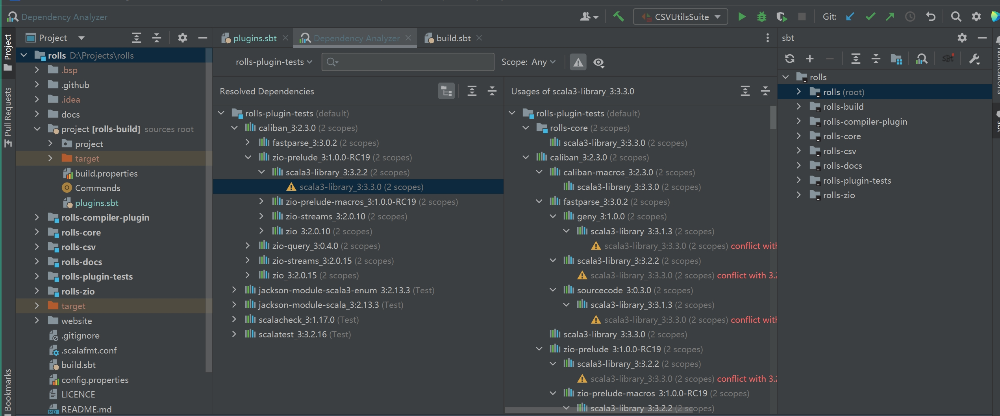

Sbt Dependency Analyzer for IntelliJ IDEA
---------


[](https://github.com/bitlap/intellij-sbt-dependency-analyzer/actions/workflows/ScalaCI.yml)
[](https://plugins.jetbrains.com/plugin/22427-sbt-dependency-analyzer)

## Features

> Support since Intellij IDEA 2023.1 (231.9392.1)

- View Dependency Tree
- Show Conflicts
- Search Dependencies
- Locate Dependency (multi-module)
- Show dependencies between modules

## Usage Instructions

To use this Intellij plugin, you must enable the `sbt-dependency-graph` plugin which is a third-party plugin, but now integrated into sbt by default (but the plugin will not be enabled by default, see [sbt issue](https://github.com/sbt/sbt/pull/5880)).

Please put this line into `project/plugins.sbt` of your project:

For sbt 1.4+ use:
```scala
addDependencyTreePlugin
```

For sbt < 1.3 use:
```scala
addSbtPlugin("net.virtual-void" % "sbt-dependency-graph" % "0.10.0-RC1")
```

Since version **0.1.1-231.9392.1**, this plugin will give a bootstrap prompt in the bottom right corner, and after clicking on the bootstrap prompt, Intellij IDEA will automatically add the `addDependencyTreePlugin` while jumping into the `project/plugins.sbt`.

<details>
<summary>Entry point 👈🏻</summary>


</details>


<details>
<summary>Show Conflicts 👈🏻</summary>



</details>

## For more details

_**The plugin will use these sbt commands**_:
1. `organization` get current project `organization`. Call once and cache when opening the dependency analysis view for the first time.
2. `moduleName` get all sbt modules. Call once and cache when opening the dependency analysis view for the first time.
3. `dependencyDot` get all dependency trees. File will be cached for an hour if you don't actively refresh dependencies or update libraryDependencies.

_**Why does it need to use these commands?**_
1. The plugin will take the last result of the `organization` command as the artifact's `groupId`. Therefore, the module must have set `organization`.
2. For multi-module projects, if root module doesn't use `ThisBuild` or `inThisBuild` to set `organization`, then each module must be configured with `organization` in order to correctly analyze the dependencies between modules (such as: module A `dependsOn` module B).
3. To verify if `organization` is correctly configured, you can execute `organization` in the sbt shell. If not configured, the `organization` is a module name, which will not be able to analyze the modules that the current module depends on.
4. The plugin will take the sbt module name to check `artifactId` in dependency trees.

## Troubleshooting issues

Due to the need for the plugin to use sbt shell, when you open the dependency analysis view and start using the Intellij IDEA to reload or build project, it may cause this problem:
```
Caused by: java.io.IOException: Could not create lock for \\.\pipe\sbt-load5964714308503584069_lock, error 5
```
Using sbt shell to load or build the project avoids this issue:

